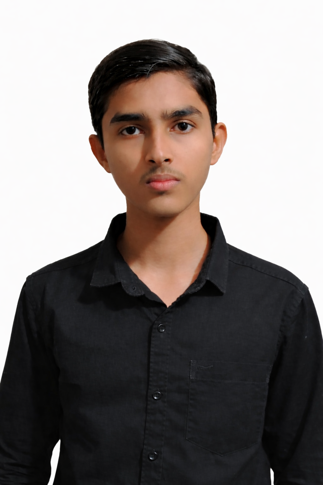

<div align="center">

# 🚀 Hamid Kamal | Professional Portfolio

[](https://hamid-portfolio-ai3q.vercel.app/)
[](https://github.com/hamid220-kamal)
[](https://linkedin.com/in/hamid-kamal-hyderabad)
[](LICENSE)



### **16-Year-Old AI Engineer & Full-Stack Developer**

*Building innovative AI-powered solutions and enterprise-grade web applications*

</div>

---

## ✨ Features

| Feature | Description |
|---------|-------------|
| 🎨 **Modern UI/UX** | Glassmorphism design with smooth animations |
| 📱 **Fully Responsive** | Optimized for desktop, tablet, and mobile |
| ⚡ **Lightning Fast** | GPU-accelerated animations for 60fps performance |
| 🌙 **Dark Theme** | Eye-friendly dark mode with gradient accents |
| 🎭 **Loading Animation** | Premium 4-second loading screen |
| 📜 **16+ Certifications** | Real certificate images from Oracle, AWS, Google & more |
| 💼 **Project Showcase** | 8+ featured projects with live demos |
| 📞 **WhatsApp Contact** | Direct messaging integration |

---

## 🛠️ Tech Stack

<div align="center">


</div>

---

## 🚀 Quick Start

### Prerequisites

- Node.js 18+ 
- npm or yarn

### Installation

```bash
# Clone the repository
git clone https://github.com/hamid220-kamal/hamid-portfolio.git

# Navigate to project
cd hamid-portfolio

# Install dependencies
npm install

# Start development server
npm run dev
```

### Build for Production

```bash
npm run build
```

---

## 📁 Project Structure

```
hamid-portfolio/
├── public/
│   ├── certificates/     # Certificate images (JPEG)
│   └── images/           # Profile and project images
├── src/
│   ├── components/       # React components
│   │   ├── Hero.tsx
│   │   ├── About.tsx
│   │   ├── Skills.tsx
│   │   ├── Projects.tsx
│   │   ├── Certificates.tsx
│   │   ├── Experience.tsx
│   │   ├── Contact.tsx
│   │   └── ...
│   ├── data/             # Static data files
│   │   ├── projects.ts
│   │   ├── certificates.ts
│   │   └── skills.ts
│   └── index.css         # Global styles
└── package.json
```

---

## 🎯 Sections

1. **Hero** - Animated intro with typing effect & 3D profile
2. **About** - Professional journey timeline
3. **Skills** - Technical expertise showcase
4. **Projects** - Featured work with modals
5. **Certificates** - 16+ industry certifications
6. **Experience** - Professional background
7. **Contact** - WhatsApp-integrated form

---

## 📊 Stats

<div align="center">

| Metric | Value |
|--------|-------|
| 📝 Lines of Code | 8,000+ |
| 📁 Components | 10+ |
| 🏆 Certifications | 16+ |
| 💼 Projects | 8+ |

</div>

---

## 🤝 Connect

<div align="center">

[](mailto:buildwithhamid@gmail.com)
[](https://wa.me/918332059777)
[](https://instagram.com/hamid220_kamal)

</div>

---

## 📄 License

This project is licensed under the **MIT License** - see the [LICENSE](LICENSE) file for details.

---

<div align="center">

**Made with ❤️ by Hamid Kamal**

*© 2025 All Rights Reserved*

</div>
